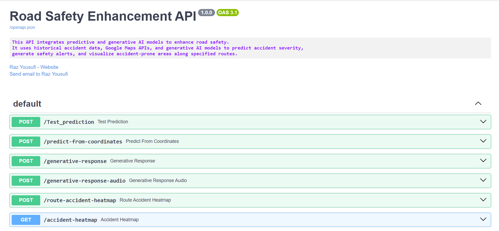

# Road Safety Enhancement through Predictive and Generative AI

## Overview

This project focuses on improving road safety by integrating predictive machine learning models and generative AI for real-time accident risk prediction and safety alerts. The system leverages a Random Forest model trained on historical UK accident data in **Google Colab**, combined with real-time data from APIs like OpenWeatherMap, HERE, and Google Maps, to predict accident-prone areas. A generative AI model (Small Language Model) provides contextual, real-time safety recommendations in both text and audio formats. **FastAPI** is used for the implementation of all the project components.

---

## Features

- **Predictive Model:** Random Forest classifier predicting accident severity based on historical and real-time data.
- **Generative AI:** A Small Language Model (SLM) generating personalized, context-specific safety alerts in text and audio formats.
- **Real-time Data Integration:** Integrates data from OpenWeatherMap, HERE, and Google Maps APIs to provide live traffic and weather updates.
- **Route-based Risk Prediction:** Predicts accident risks along specific routes in real time.
- **API-based Architecture:** FastAPI framework for efficient handling of model requests and generating alerts.

---

## System Architecture

1. **Data Collection:**
    - Historical UK road accident data (CSV format).
    - Real-time traffic, weather, and geographic data from OpenWeatherMap, HERE, and Google Maps APIs.
  
2. **Predictive AI:**
    - Random Forest Classifier trained on Google Colab using class-balancing techniques and optimized hyperparameters.
  
3. **Generative AI:**
    - Phi-3 Small Language Model (SLM) generates safety recommendations based on real-time input.
  
4. **API Integration:**
    - Weather and traffic data from OpenWeatherMap, HERE, and Google Maps APIs are integrated to enhance real-time predictions.
  
5. **FastAPI Implementation:**
    - All components are integrated and deployed using FastAPI for real-time interaction and safety alert generation.

---

## Requirements

To run this project, ensure the following dependencies are installed:
```bash
pip install -r requirements.txt
```

Key dependencies include:

- Python 3.x
- FastAPI
- scikit-learn
- OpenAI API
- OpenWeatherMap API
- HERE API
- Google Maps API

---

## Setup Instructions

### 1. Train the Predictive Model (Google Colab)

The Random Forest model is trained in **Google Colab**. To train the model:

1. Upload the [dataset]([https://openai.com](https://www.kaggle.com/datasets/syedibrahim03/road-accidents-dataset/data)) to your Jupiter Notebook or Google Colab environment .
2. Run the provided notebook to preprocess the data and train the model.
3. Save the trained model as a `.joblib` and other required artifacts for use in FastAPI.

### 2. Clone the Repository

Download or clone the repository to your local environment and navigate to the project directory. Example code for cloning:
```bash
git clone https://github.com/yourusername/road-safety-ai.git
cd road-safety-ai
```
### 3. Set Up API Keys

You will need API keys for:
- OpenWeatherMap
- HERE
- Google Maps

Create a `.env` file and add your keys following the appropriate format. For instance:
```bash
OPENWEATHERMAP_API_KEY=your_openweathermap_key
HERE_API_KEY=your_here_key
GOOGLE_MAPS_API_KEY=your_google_maps_key
```

### 4. Data Preprocessing

Use the preprocessing **utils.py** script to clean and prepare the data for the predictive and generative modles.


### 5. Implement the Generative AI Model

To set up the generative AI model for generating alerts, initialize the Phi-3-mini model for real-time safety alert generation.

### 6. FastAPI Implementation

Start the FastAPI server with typing the folloing command in the environment terminal.
```bash
uvicorn main:app --reload
```

You can test and visualize the responses directly on this interactive FastAPI documentation page.
---

## Usage

### Access FastAPI UI Interface

To access FastAPI's user interface in your web browser, navigate to `http://127.0.0.1:8000/docs` after starting the server. This interface allows you to interact with the API by providing inputs such as location coordinates and receiving real-time predictions from the predictive model and safety recommendations from the generative AI.

Simply select the endpoint you want to test (e.g., `/predict-from-coordinates`), enter the required data, and the model will provide its predictions. See figure below:




<p align="center">
  
</p>

### Accident Severity Prediction

To predict accident severity based on geographic coordinates and real-time data, make an API request with the necessary latitude and longitude data. The API will return a severity prediction (0, 1, or 2) and relevant risk information.
```bash
curl -X POST "http://127.0.0.1:8000/predict-from-coordinates" \
-H "Content-Type: application/json" \
-d '{"latitude": <lat>, "longitude": <lon>}'
```
### Generate Safety Alerts

To generate real-time text or audio safety alerts, make an API request with location data to receive a contextual recommendation based on the predicted risk.
```bash
curl -X POST "http://127.0.0.1:8000/generate-alert" \
-H "Content-Type: application/json" \
-d '{"latitude": <lat>, "longitude": <lon>}'
```
### Route Risk Prediction

For route-based accident risk prediction, provide origin and destination points, and the system will assess the accident risk along the specified route, delivering safety alerts.
```bash
curl -X POST "http://127.0.0.1:8000/route-prediction" \
-H "Content-Type: application/json" \
-d '{"origin": "<start_point>", "destination": "<end_point>"}'
```
---

## Future Enhancements

- **V2V and V2I Data Integration:** Incorporate vehicle-to-vehicle and vehicle-to-infrastructure data for improved prediction accuracy.
- **Advanced Generative Models:** Implement Transformer-based models for more accurate and contextually aware safety alerts.
- **Adaptability Across Regions:** Test the system in different regions and road networks for enhanced geographic adaptability.
- **User Feedback Integration:** Collect real-time user feedback for continuous improvement of safety recommendations.

---

## License

Yet to be approved

---

## Acknowledgments

Thanks to:
- Hope University for providing me access to a wide range of data sources.
- Microsoft and HuggingFace for making the Phi-3 model publically available.
- OpenWeatherMap, HERE, and Google Maps for making the real-time data publically available through their APIs.
